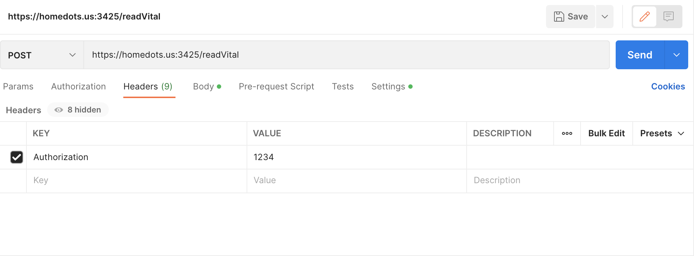
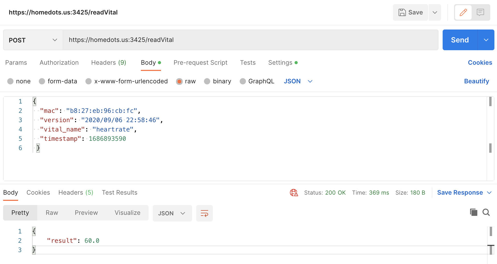
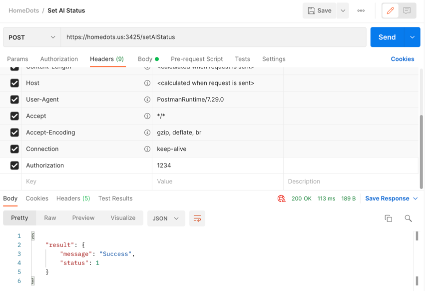
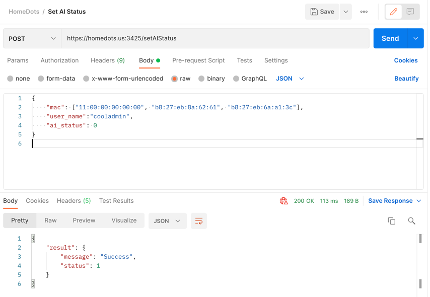

# HomeDots API Endpoints

### APIs for Device

<!-- Get License -->
<details>
 <summary><code>POST</code> <code><b>/getLicense</b></code> <code>Returns the token of a device</code></summary>

_Requires Device Authorization:_ `No` \
_Requires User Authorization:_ `Yes`

##### Body Parameters

> | name         | type     | data type | description                   |
> |--------------|----------|-----------|-------------------------------|
> | `mac`        | required | string    | The mac address of the device |
> | `user_name`  | required | string    | The name of the user          |

##### Responses

> | http code | content-type       | response                                                           |
> |-----------|--------------------|--------------------------------------------------------------------|
> | `200`     | `application/json` | `{"result": {"status": 1,"token": "1234"}}`                        |
> | `404`     | `application/json` | `{"result": {"status": 0}}`                                        |
> | `400`     | `application/json` | `{'result': {'message': "Invalid MAC address (or other errors)"}}` |
> | `401`     | `application/json` | `{'result': {'message': "Unauthorized"}}`                          |

##### Example cURL

> ```bash
> curl --location 'https://homedots.us:3425/getLicense' \
> --header 'Authorization: mySecREtToK3n' \
> --header 'Content-Type: application/json' \
> --data '{
> "mac": "00:00:00:00:00:88",
> "user_name": "adminofhomedot"
> }'
> ```

---
</details>

### APIs for User

<!-- Read Vital in Range -->
<details>
 <summary><code>POST</code> <code><b>/readVitalInRange</b></code> <code>Returns the values of a vital within a specified time range for the device</code></summary>

_Requires Device Authorization:_ `Yes` \
_Requires User Authorization:_ `No`

##### Body Parameters

> | name              | type     | data type | description                                                                |
> |-------------------|----------|-----------|----------------------------------------------------------------------------|
> | `mac`             | required | string    | The mac address of the device                                              |
> | `vital_name`      | required | string    | Name of the vital ('heartrate', 'respiratoryrate', 'systolic', 'diastolic' |
> | `start_timestamp` | required | integer   | Start of range in UNIX (i.e. 1686885098)                                   |
> | `end_timestamp`   | required | integer   | End of range in UNIX   (i.e. 1686985098)                                   |

##### Responses

> | http code | content-type       | response                                                           |
> |-----------|--------------------|--------------------------------------------------------------------|
> | `200`     | `application/json` | `{"result": [80.22, 93.24, ...]}`                                  |
> | `404`     | `application/json` | `{"result": {"status": 0}}`                                        |
> | `400`     | `application/json` | `{'result': {'message': "Invalid MAC address (or other errors)"}}` |
> | `401`     | `application/json` | `{'result': {'message': "Unauthorized"}}`                          |

##### Example cURL

> ```bash
> curl --location 'https://homedots.us:3425/readVitalInRange' \
> --header 'Authorization: 1234' \
> --header 'Content-Type: application/json' \
> --data '{
> "mac": "00:00:00:00:00:88",
> "vital_name": "heartrate",
> "start_timestamp": 1686893432,
> "end_timestamp": 1686893432 }'
> ```

---
</details>

<!-- Read Vital -->
<details>
 <summary><code>POST</code> <code><b>/readVital</b></code> <code>Returns the average values of a vital at a specific time for the device</code></summary>

_Requires Device Authorization:_ `Yes` \
_Requires User Authorization:_ `No`

##### Body Parameters

> | name            | type     | data type | description                                                                |
> |-----------------|----------|-----------|----------------------------------------------------------------------------|
> | `mac`           | required | string    | The mac address of the device                                              |
> | `vital_name`    | required | string    | Name of the vital ('heartrate', 'respiratoryrate', 'systolic', 'diastolic' |
> | `timestamp`     | required | integer   | Time in UNIX (i.e. 1686885098)                                             |

##### Responses

> | http code | content-type       | response                                                           |
> |-----------|--------------------|--------------------------------------------------------------------|
> | `200`     | `application/json` | `{"result": 59.81}`                                                |
> | `404`     | `application/json` | `{"message": "No data with 5 seconds of timestamp"}`               |
> | `400`     | `application/json` | `{'result': {'message': "Invalid MAC address (or other errors)"}}` |
> | `401`     | `application/json` | `{'result': {'message': "Unauthorized"}}`                          |

##### Example cURL

> ```bash
> curl --location 'https://homedots.us:3425/readVital' \
> --header 'Authorization: 1234' \
> --header 'Content-Type: application/json' \
> --data '{
> "mac": "00:00:00:00:00:88",
> "vital_name": "heartrate",
> "timestamp": 1686893432 }'
> ```

---
</details>

### Example: Entering Device Authorization in Postman
#### Authorization is done with a token that corresponds the MAC address

Headers Field:



Body and Response:



---

### Example: Entering User Authorization in Postman
#### Authorization is done with a token that corresponds to their username

Headers Field:



Body and Response:




---
